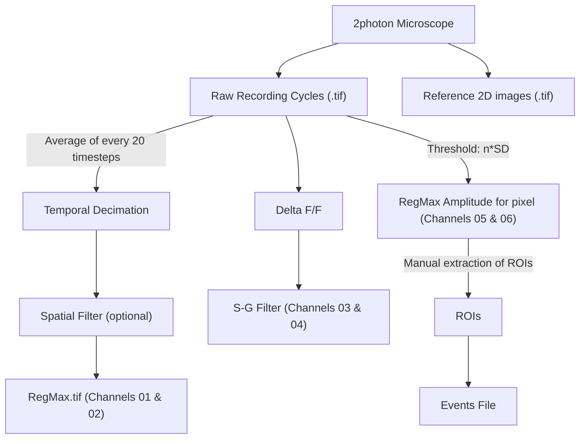

# LineScan Analysis Pipeline
- author: Carlos Vivar Rios
- date: 2019-02-25

<!-- TOC depthFrom:1 depthTo:6 withLinks:1 updateOnSave:1 orderedList:0 -->

- [LineScan Analysis Pipeline](#linescan-analysis-pipeline)
	- [Iaroslav LS Analysis Pipeline](#iaroslav-ls-analysis-pipeline)
		- [Folder structure](#folder-structure)
		- [Analysis](#analysis)
			- [Criteria to describe events](#criteria-to-describe-events)
	- [LineScan XLSX metadatabase](#linescan-xlsx-metadatabase)
		- [Events sheets](#events-sheets)

<!-- /TOC -->

## Iaroslav LS Analysis Pipeline

This diagram was built based on comments and the ImageJ macros by Iaroslav. This Macro can be found in `smb://nas-fbm-av1.unil.ch/AV_NAS_PRIVATE/Iaroslav_2/for Erika/ImageJ - linescan`




### Folder structure

The files are stored in `\\nas-fbm-av1.unil.ch\AV_NAS_PRIVATE\Iaroslav_2\Volterra Lab Data\imaging\2Photon`. **Be care about the Iaroslav folder at UNIL NAS because is a partal copy of this one but without the events analysis.**

```
- Experiments
  - /references/
    - /LineScan-DDMMYYYY-sX-cXX-XXX-CycleXXXXX-Ch1-16bit-Reference.tif
    - /LineScan-DDMMYYYY-sX-cXX-XXX-CycleXXXXX-Ch2-16bit-Reference.tif
    - /LineScan-DDMMYYYY-sX-cXX-XXX-CycleXXXXX-Window1-Ch1-8bit-Reference.tif
    - /LineScan-DDMMYYYY-sX-cXX-XXX-CycleXXXXX-Window2-Ch1-Ch2-8bit-Reference.tif
    - /LineScan-DDMMYYYY-sX-cXX-XXX-CycleXXXXX-Window3-Ch2-8bit-Reference.tif
    - /LineScan-DDMMYYYY-sX-cXX-XXX-CycleXXXXX-Window4-Ch1-Ch2-8bit-Reference.tif
  - /anal/
    - /LineScan-DDMMYYYY-sX-cXX_ch2.roi
    - /LineScan-DDMMYYYY-sX-cXX_ch2.txt
    - /LineScan-DDMMYYYY-sX-cXX-XXX_CycleXXXXX_Ch1_XXXXXX.ome.tifRegMax.tif
    - /RoiSet.zip
  - /LineScan-DDMMYYYY-sX-cXX-XXX.env
  - /LineScan-DDMMYYYY-sX-cXX-XXX.xml
  - /LineScan-DDMMYYYY-sX-cXX-XXX_CycleXXXXX_Ch1Source.tif
  - /LineScan-DDMMYYYY-sX-cXX-XXX_CycleXXXXX_Ch2Source.tif
  - /LineScan-DDMMYYYY-sX-cXX-XXX_CycleXXXXX_Ch1_XXXXXX.ome.tif [ Multiple files]
  - /LineScan-DDMMYYYY-sX-cXX-XXX_CycleXXXXX_Ch2_XXXXXX.ome.tif [ Multiple files]


```


### Analysis
The result of the analysis is the .tif file located in `/anal/` folder. This file contains 6 channels and the $x$ axis define **time** while $y$ axis define the line traced by the microscope, so **space**.

The channels follow this legend:

Channels | Pipeline Step | Description
-- | -- | --
Channel 01 |  Temporal Decimation and Spatial Filter for Microscope Channel 01 | Every 20 timesteps are averaged into 1 and the spatial filter depends on SNR
Channel 02 |  Temporal Decimation and Spatial Filter for Microscope Channel 02 | Same
Channel 03 | $\dfrac{\Delta F }{F}$ with S-G filter from Channel 01 | The Savitzky-Golay filter smooth the curve.
Channel 04 | $\dfrac{\Delta F }{F}$ with S-G filter from Channel 02 | The Savitzky-Golay filter smooth the curve.
Channel 05 | RegMax amplitude for each pixel from Channel 03 | It uses a threshold. Is defined in the filename *_rm15.0_* and means q5 times the standard deviation of the RegMax amplitude distributions.
Channel 06 | RegMax amplitude for each pixel from Channel 04 | Same


**Figure:** Example of the file with the segmentation of the process and soma (**Horizontal Bars** and the different events ROIs.

>**IAROSLAV**: Now, be careful about the units on the event display window: y is space along line, x is time in decimated units (typically 20 timepoints are averaged into 1!). The ROI coordinates use vertical units (space) correctly (1 pixel in ROI-y is 1 pixel along the line L), but the horizontal (time) units for the ROI need to be recalculated. Note that FWHM for time is shown in time sample points, but ROI x is shown as (sample_points)/(decimation factor)


#### Criteria to describe events
The characterization of events must take in account different aspect that were compile from different Iaroslav emails:

> Some multi-peak events are not properly detected, if the preceding event does not properly decay back to the baseline. In practice, Iaroslav allowed a decay to 10-20%.

> Hence is my insistence that the cross-condition comparison is done by the same person: subjective biases will at least be reasonably constant (as opposed to one person analyzing control and another person analyzing the knockout)

## LineScan XLSX metadatabase
This excel has the following structure.
- First sheet: General information about the experiments.
- Second sheet: Ip3 DB
- Third sheet: Other DB
- GCAMP6 GREEN EVENTS: All the results that we can find in the folders of every experiment.
- RED Control Mice EVENTS:
- GREEN Control Mice EVENTS:

The spreadsheet is on `smb://nas-fbm-av1.unil.ch/AV_NAS_PRIVATE/Vivar/001_LineScan Project/LINESCAN event database Excel 1k_with_ip3KO_Iaroslav_20180828.xlsx`

### Events sheets
The order of the columns is importat because even if some of them share names it correspond to Ch1 event or Ch2.

**In the original xlsx the FWHM are named wrongly FTWH**

Column | Description
--- | ---
**Cell line ID** | ID of the cell
**Acq sequence** | ID of the acquisition including **s**, **c** and **date**
**Ch1 Event location label** | Contains the headers of the next columns related to Ch1 and Ch2 events.
**x** | $x$ coordinate of ROI box
**y** | $y$ coordinate of ROI box. This is the real time an is decimated  so to obtain the time must $t = y * 20 * Sampling Rate$.
**w** | *width* of ROI box
**h** (manual spatial 'spread' marker) | *height* of ROI box. Assuming that space is described in the $y$ axis this could be used as a manual spatial marker.
**Ch1 Event properties label** | Contains the headers of the next columns related to Ch1 events.
**Ampl** | Amplitude of the event in channel 1
**Baseline**| Baseline of the event in channel 1
**FWHM time** | Temporal expansion of the FWHM in channel 1
**FWHM space (automatic calc, buggy, DO NOT USE)** | Spatial expansion of the FWHM in channel 1
**Ch2 Event properties label** | Contains the headers of the next columns related to Ch2 events.
**Ampl** | Amplitude of the event in channel 2
**Baseline**| Baseline of event in channel 2
**FWHM time** | Temporal expansion of the FWHM in channel 1
**FWHM space (automatic calc, buggy, DO NOT USE)** | Spatial expansion of the FWHM in channel 1
**Sampling interval (s)** | Interval between two images
**Resolution (micron per pixel)** | Equivalency between micrometers and pixels
**Ch1 Indicator label** | Indicator used for channel 1. **s**: SR101, **g6**: GCamp6F
**Ch2 Indicator label** | Indicator used for channel 1. **s**: SR101, **g6**: GCamp6F
**Soma middle position (pixels)** | Central position of the SOMA **If the laser cross the soma twice is not described?**
**Process start (pix)** | Coordinate of the process start
**Process stop (pix)** | Coordinate of the process end

The number of colums will be different because if one cell recording contains more than 1 process will have two extra columns (Process start and Process stop) for every proccess.
