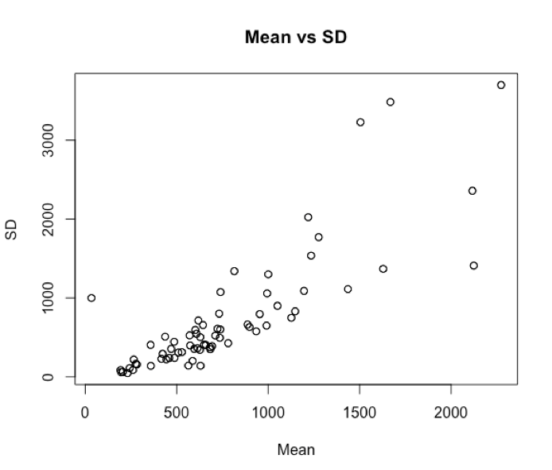

# Analysis scripts

## Interspike Interval Analysis on R

This code will read an xlsx containing events from Linescan experiments. Then it will order the events by process (taking in account the beggining and the end). Using this sorting will look for processes where more than 3 events has been described and calculate the average time interval and the standard deviation. Finally it will produce a plotting.



```R
setwd("/Volumes/AV_NAS_PRIVATE/Vivar/001_LineScan Project")
require(xlsx)
# sudo ln -s $(/usr/libexec/java_home)/jre/lib/server/libjvm.dylib /usr/local/lib


preprocessing <- function(rawtable){
  # Will take the columns of interest from the rawtable than the xlsx provides.

  CellID <- rawtable$Cell.line.ID
  Seq <- rawtable$Acq.sequence
  #EventTime <- rawtable$FTWH.time.1
  EventTime <- rawtable$x
  SomaCoor <- rawtable$Soma.middle.position..pixels.
  Start <- rawtable$Process.start..pix.
  End <- rawtable$Process.stop..pix.

  dataframe <-data.frame(CellID, Seq, EventTime, SomaCoor, Start, End)
  #colnames(dataframe) <- c("CellID", "Seq", "EventTime", "SomaCoor", "Start", "End")

  return(dataframe)
}

processesTagging <- function(dataframe){
  # This function will look for the same process in the same CellID. It will tag every process with an unique ID number in ProcessID column.

  for (event in c(1,length(dataframe))){
    Totalprocesses <- unique(dataframe[, -(2:3)]) # I'm taking the columns of interest to determine the process
    Cells <- unique(Totalprocesses$CellID)

    dataframe$ProcessID <- rep(0,times=nrow(dataframe))

    for (Cell in Cells){
      processes <- Totalprocesses[ Totalprocesses$CellID == Cell, ]
      for (i in c(1:nrow(processes))){
        dataframe[ (dataframe$CellID == Cell) & (dataframe$Start == processes$Start[i]), ]$ProcessID <- i
      }
      #dataframe[(dataframe$CellID == 2 ) & (dataframe$Start == 362), ]
    }
  }
    return(dataframe)
}

intervalStatCalculator <- function(Events){
  # Will take a vector of events times and calculate the difference between then
  EventsSorted <- sort(Events)
  intervals <- c()

  for (i in c(2:length(EventsSorted)-1)){
    # Maybe this gives an error because we need to don't iterate over the last number.
    print(i)
    intervals[i] <- EventsSorted[i+1] - EventsSorted[i]
  }

  intervalMean <- mean(EventsSorted)
  intervalSD <- sd(EventsSorted)

  return(c(intervalMean,intervalSD))

}

plotting <- function(masterDF){
  plot(masterDF$Mean, masterDF$SD, main="Mean vs SD", xlab = "Mean", ylab = "SD")
}


main <- function(){
  files <- list.files(".", pattern = ".xlsx",full.names=T)
  res <- read.xlsx(files[2], 4, as.data.frame=TRUE, header=TRUE)

  dataframe <- preprocessing(res)
  print("Preprocessed")
  ProcessTaggedDF <- processesTagging(dataframe)
  print("Processes Tagged")

  CellsIDs <- unique(ProcessTaggedDF$CellID)
  MasterDF <- data.frame(matrix(ncol = 4, nrow = 0))
  colnames(MasterDF) <- c("CellID", "ProcessID", "Mean", "SD")
  print("MasterDF created")

  for (Cell in CellsIDs){
    ProcessesNumber <- unique(ProcessTaggedDF[dataframe$CellID == Cell,]$ProcessID)

    for (Process in seq_along(ProcessesNumber)){
      EventsTime <- ProcessTaggedDF[(ProcessTaggedDF$CellID == Cell & ProcessTaggedDF$ProcessID == Process),]$EventTime

      if (length(EventsTime) > 2){
        Stats <- intervalStatCalculator(EventsTime)

        MasterDF <- rbind(MasterDF, data.frame(CellID = Cell, ProcessID = Process, Mean = Stats[1], SD = Stats[2]))

      } else {
          #print(paste(Cell, Process, "doesn't have enough events", sep = ' '))
      }
      #print(paste(Cell, " Stats Completed", sep = ' '))
    }
  }

  plotting(MasterDF)

  }

main()
```

<div>
    <a href="https://plot.ly/~Kato/53/?share_key=cCA01v69zd11aRCV5U5nYh" target="_blank" title="Plot 53" style="display: block; text-align: center;"></a>
    <script data-plotly="Kato:53" sharekey-plotly="cCA01v69zd11aRCV5U5nYh" src="https://plot.ly/embed.js" async></script>
</div>
