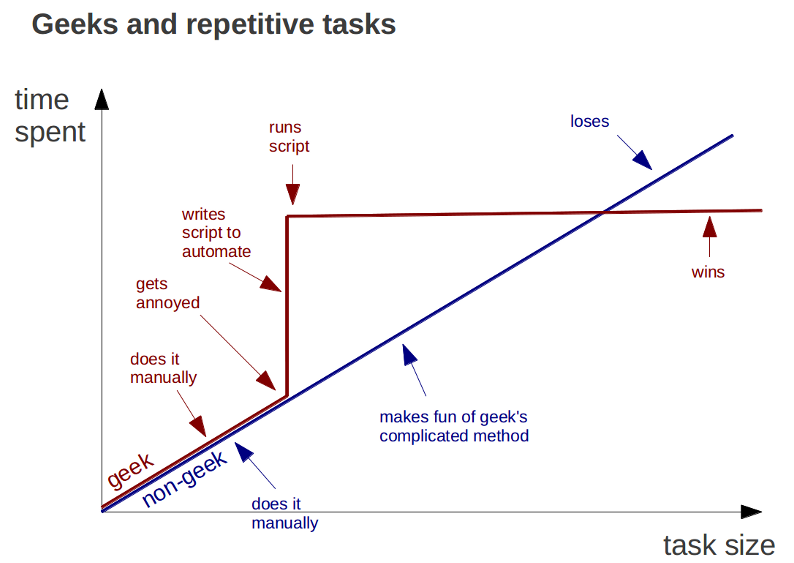
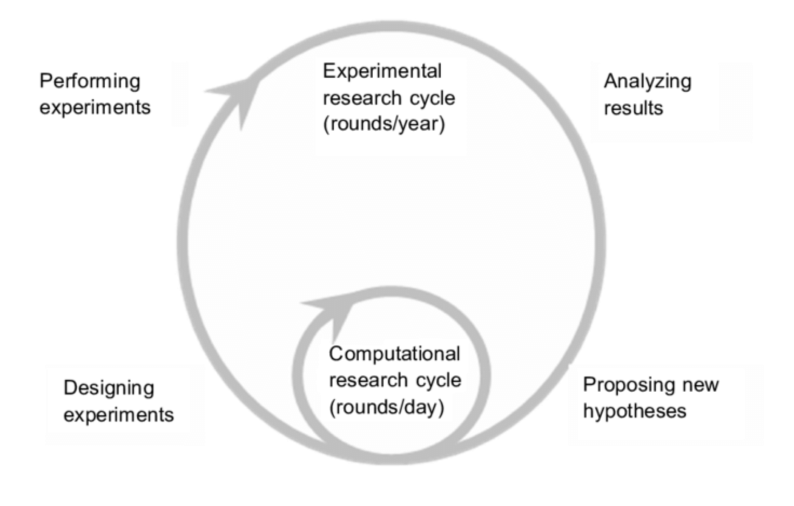
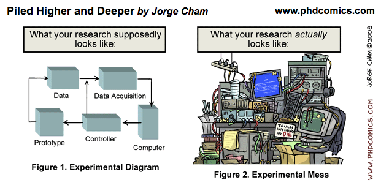

# Welcome to Volterra Dry Lab Guide

Here you will find all the relevant information regarding IT equipment, servers use, tools developed and much [ m](img/cat_comt.gif)ore.

## Lastupdates (Changelog)

- **14/05/2019**: JupyterHUB guide
- **25/03/2019**: Introduced Iaroslav tutorials and Jupyter notebook.
- **16/12/2019**: ITK-SNAP 3D ATLAS
- **27/01/2020**: New NAS server
- **09/03/2020**: Jupyter Local connection

## List of content

* Information about the servers
* Information about the NAS
* Programs developed in the Lab
* Good practices in script developing and analysis

## Dry Work Phylosophy

The computers are our partners in research and every task could be improved in some ways. As scientists we need to save as much time as we could from irrelevant (a.k.a. automatic/low cognitive) tasks. There is a "law" in computer science: if you are doing something repetitive, maybe it's time to let computers do it for you.

In every task that we are doing we need to think in a **balance between the effort to learn, the effort to use and the amount of time saved**. This is something that must be taking in account before start doing the task. When deliberating, don't think just in the time that you'll save also in the time that your team mates are going to invest using your tool, finding your data or understanding your notes.

In the other hand the aim of this documentation is to unified the information about the IT equipment that we have. It could be use to improve the performance of data analysis taks with good manner shared among us.

## Tips and papers

1. Keep metadata information in a structured datatable file (excel, csv, etc)
2. Use standard names for files and folders
3. Try to compress using .zip

- [Good enough practices in scientific computing](https://journals.plos.org/ploscompbiol/article?id=10.1371/journal.pcbi.1005510)
- [Reproducible research in computational science](https://moodle.epfl.ch/pluginfile.php/1479581/mod_folder/content/0/Reproducible_Research_in_Computational_Science-Science-2011-Peng.pdf)

## Credits

This documentation uses [Mkdocs](https://www.mkdocs.org/), it's a simple tool to write plain text markdown files and then turn it into a website. If you want to know how to add content just contact with: [carlos.vivarrios@unil.ch](mailto:carlos.vivarrios@unil.ch)
