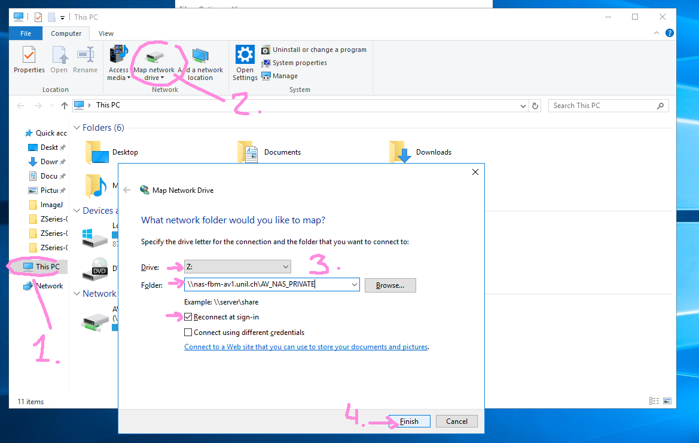
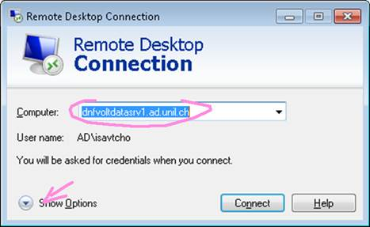
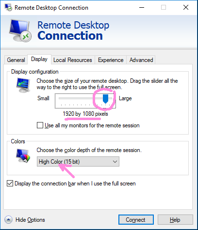
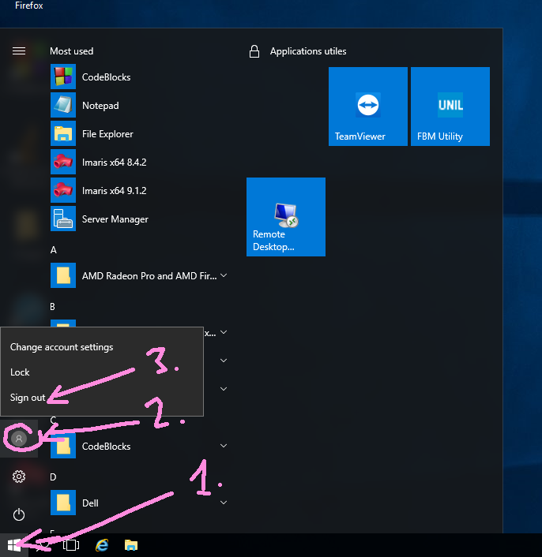
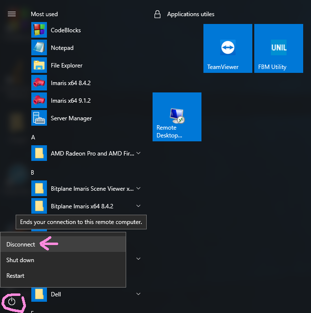

# Storage and Computing Servers

We actually count with 3 servers. Two of them are physically in the room and we count with a wireframe at UNIL computing facilities (NAS).

To use the computer remotely go to "How to conect?" tutorial.

**Don't shut down the computer, disconect your session when your work is over**

## Computing Servers
### [dnfvoltdatasrv1.ad.unil.ch](dnfvoltdatasrv1.ad.unil.ch)

- **IP**: 130.223.196.101
- **CPU**: 48 Cores
- **RAM**: 1 TB
- **Graphic card**: Radeon WX7100
- **Storage**: 2TB SDD
- **Software**: Imaris 8.4.2/Imaris 9.1.2/Matlab R2015b-R2018/ImageJ
- **Frequent users**: Cedric, Iaroslav and Carlos


### [dnfvoltdatasrv2.ad.unil.ch](dnfvoltdatasrv2.ad.unil.ch)

- **IP**: 130.223.196.100
- **CPU**: 16 Cores
- **RAM**: 764GB
- **Graphic card**: Radeon WX7100
- **Storage**:  6TB SSD and:
	- Iaroslav Disk 625GB
	- Other Disk 600GB
- **Software**: Imaris 8.4.2/Matlab/ImageJ/LLastik/Blender
- **Frequent users**: Barbara and Iaroslav

### 130.223.197.152
We are going to configure a computing server based in Ubuntu. We are going to use it mainly for non-graphical computational tasks that will be send to the server through a password secured ssh connection using the slurm workload manager.


- **IP**: 130.223.197.152
- **CPU**: 48 Cores
- **RAM**: 1TB
- **OS**: Ubuntu 18.04
- **Graphic card**: Quadro P5000
- **Storage**:  2TB SSD
- **Software**: Python2/Python3/R/Matlab/Ruby/Julia/
- **Frequent users**: Carlos, Erika, Cedric and Claudia

#### Jupyter hub

##### How to use it

To access you need to write `130.223.197.152:7777` in your browser. This will allow you to have your jupyter session. The path of the folder that appear in your left is `/home/jhub/jupyter_server` and if you open a terminal this will connect directly to your linux session.

You can login with your name and the password that you must know ;)

If you wish to have access to the clasic jupyter notebook interface you can access changing the link deleting lab and adding `tree`:
```
130.223.197.152:7777/user/{your name}/tree
```
This a production environment so that means that we are going to keep the system as stable as possible. If you require some packages, just tell me. And if there is any conflict we can study how to create a new virtual environment for you. But by now let's try to use all the last version of python packages in `python 3.7`. 

##### How to install it

In order to configure jupyterhub an administrator account has been created: *jhub*. Inside their home folder a **jupyter_server** folder has been created and the NAS has been mounted there with reading permissions. A file named `mountNAS.sh` could be executed to remount again the NAS. All the other folders have been granted with reading/writting permissions in order to allow other users to create notebooks.

During the installation numerous problems appeared:

- Shared packages: Anaconda was installed in /opt/anaconda3
	- Problem with the proxy path: `c.ConfigurableHTTPProxy.command = '/opt/anaconda3/bin/configurable-http-proxy'`
- Configuration of the IP and port:
	- `c.JupyterHub.bind_url = 'http://130.223.197.152:7777'`
	- `c.ConfigurableHTTPProxy.api_url = 'http://130.223.197.152:7776'`
- Creation of users: A system account has been created for every user in the whitelist.
- Permissions problems: The users only can write or open notebooks in those folders allowed to

The execution of the server must be done in root after doing a `sudo -s`. Is inside a tmux session that could be attached using `tmux attach-session -t jupyterhub`

### Relevant points

The authorship of this points belongs to Y. Savchuk.

1.	Do not shutdown these machines. Please do not restart these machines if other users are still connected, without asking!
2.	Volterra NAS can be accessed natively by mapping \\nas-fbm-av1.unil.ch\AV_NAS_PRIVATE to a disk letter (e.g. Z: ,  see picture below). Use  \\nas.unil.ch for the UNIL NAS. Use can also directly type these into the Explorer address bar.
3.	For fastest connection (especially from home), use the lowest color depth setting for Remote Desktop settings (High Color 15-bit setting). If you have a High-DPI screen (such as 3200 x 1800, common on modern laptops), you will also get much better speed by reducing your display screen resolution to e.g. 1920 x 1080 before connecting.
4.	Already installed are: Matlab R2016a, ImageJ, and Imaris 8.4 and 9.0. Imaris 9.0 is only working on dnfvoltdatasrv1 (but there is a limit on UNIL licenses, so best to try in the morning before everyone arrives). If you do not get a license, you can also use 8.4  on dnfvoltdatasrv2 (license is always available for the moment)
5.	Try to avoid saving your documents to the local C: drive (i.e. your Desktop, My Documents, etc.). Please use NAS or your external drives instead. We only have 1 TB capacity for C: , so it will fill up fast. To attach an external USB drive, you will have to physically access the machine and plug your disk into one of the USB ports.
6.	When you are done, please “Sign out” instead of disconnecting (see below how to do that).
7.	Since the RAM and video card are shared, please close the programs you do not use, particularly Imaris. One important trick is to minimize the Imaris windows if you leave them open for a long time: there is a bug where the video RAM will keep getting eaten up over time, leading to a crash, unless the window is minimized.
8.	You can view total RAM consumption through the Task manager, as well as check how much is in use by the other users (see below)
9.	To connect from home, use Pulse Secure first to get onto UNIL network. Please make sure your personal computer is virus-free.
10.	If you have old accounts on the dnfvoltdatasrv2 machine, these can still be used
11.	The machines will be restarted weekly on Saturday nice in order to install the updates (on Sunday 1 AM, actually). If this is not OK for you (running computations, etc), we can postpone the shutdown manually: just get in touch.

## NAS storage

The lab counts with various NAS that offers storage.

If you want to connect you can access directly from the explorer address line or in mac from the finder > go to option.

### Synology

To access to the control panel is necesary to have an administration account and access through here [http://130.223.30.65:5000/](http://130.223.30.65:5000/).

#### Known issues

From time to time a backup fail appears. This must be consider normal if only happens sporadically.


### NEW UNIL NAS

This is the new NAS that we allocated. We will transfer all our data to this common NAS. 

- D2c: Everything inside this folder is backup. We will work by now in this folder
smb://nas.unil.ch/RECHERCHE/FAC/FBM/DNF/avolterr/default/D2c

- LTS: Long Term Storage. For data archiving old datasets. See instructions because it requires specific description of the dataset structure. 
smb://nas.unil.ch/RECHERCHE/FAC/FBM/DNF/avolterr/default/LTS

We need to transfer at least 10TB to this NEW NAS from VOLTERRA NAS. So inside, D2c you can find two folders ‘data’, ‘projects' and ‘personal’. 
	- data: In this folder is planned to be stored all raw data
	- projects: In this folder is planned to be stored shortcuts to the raw data, analysis, results and documentation by project. 
	- personal: In this folder we can find all our users folders where we can organise the middle files, shortcuts to the original files, personal code, etc. Please create a folder with your name. 
	
I propose to start using a more structured way of saving the data with compatibility with the Data Management Plans that will be requested  by UNIL in the future. That’s why we need to keep the original raw data in a separated folder organised by user and then technique. This will include even discarded recordings. An excel file with a list of the files needs to be included too. 

Then the project folder will need to contain shortcuts to the data files/folders (to facilitate the use of graphical tools) and an excel file with information about the experiments needs to be included too ( to be used in automatic batch analysis). 

### UNIL NAS

This NAS belongs to university and every member of the lab has a PRIVATE folder that could be used.

To access to this NAS use this address in windows:
```
\\nas.unil.ch\FBM
```

To access to this NAS use this adress in mac:
```
//nas.unil.ch/FBM
```

### Volterra's NAS

This NAS is for private use in the laboratory. Every member has a folder on it.

- IP: 130.334.30.65
- 10 gigabits (1gb/user)
- RAID6
- Secondary backup per day at 1am with backup explorer.
- In Sunday it does a parity check.

To access to this NAS use this address in windows:
```
\\nas-fbm-av1.unil.ch\AV_NAS_PRIVATE
```

To access to this NAS use this adress in mac:
```
//nas-fbm-av1.unil.ch/AV_NAS_PRIVATE
```

#### 2018 Upgrade:

28 Disk of 10TB SATA 6GB/s  -> 0,28 Petabytes

Upgrade made by art computer

## How to access to a NAS?

### Windows

To connect to NAS, use the link in the information of the webpage.




### Mac

<iframe width="560" height="315" src="https://www.youtube.com/embed/Ja5TeET99Sc" frameborder="0" allow="autoplay; encrypted-media" allowfullscreen></iframe>


### Linux

#### NAS installation on Linux Terminal

In Ubuntu is required to install next:

```bash
sudo apt-get install cifs-utils
sudo apt install smbclient
```

and then we could conect using this command using your EMAIL

```bash
smbclient -U EMAIL //nas-fbm-av1.unil.ch/AV_NAS_PRIVATE
```

If you want to mount the NAS in an specific folder you need to use this command but using the domain of the group (**AD**) and your ID (e.g. **cvivarri**)

```bash
sudo mkdir /media/nas-fbm-av1
sudo mount -o username=ID,domain=AD //nas-fbm-av1.unil.ch/AV_NAS_PRIVATE/ PATH_TO_FOLDER
```

Once this is done you could access to the files through the terminal.

#### Graphical NAS installation on Linux

You need to use your ID (e.g. cvivarri), the Group Domain **AD**, and the link to the NAS **smb://nas-fbm-av1.unil.ch**

<iframe width="560" height="315" src="https://www.youtube.com/embed/UyAGYpx-vn0" frameborder="0" allow="autoplay; encrypted-media" allowfullscreen></iframe>

## How to connect to remote desktop servers?

### Windows

1. To connect from your desktop or laptop:




2. To log off:



4. To disconnect, and leave your programs running, click Disconnect (or simply close the Remote Desktop window):



### Mac

Donwload the application Remote Desktop Connection and follow the instructions for the windows tutorial.

<iframe width="560" height="315" src="https://www.youtube.com/embed/x7TCvLuWlF0" frameborder="0" allow="autoplay; encrypted-media" allowfullscreen></iframe>

## Supercomputing UNIL services

In case that we need more computational power in task that doesn't require a graphic interaction we could apply for an account in some of the supercomputing cluster that UNIL has.

### List of HPC services

[Service de calcul de UNIL](https://www.unil.ch/ci/fr/home/menuinst/catalogue-de-services/enseignement-et-recherche/service-de-calcul.html)

Types of scientific computing resources available at the Ci:

The new features are higlighted in blue

#### Argos
Argos is an Intel Xeon based 8 cores interactive compute server offering GPGPU capabilities:

- Job category: Any suitable interactive job
- Access: via ssh to argos1.unil.ch
- OS: Redhat ELS 6.1
- CPUs: 1 x dual Xeon 5570 2.97 GHz node (8 cores), 24 GB RAM
- GPGPU:
	- 1 x Nvidia Tesla c1060 (220 CUDA cores)
	- 1 x Nvidia Tesla c2070 (448 CUDA cores)
- Network:10 Gb/s Ethernet

#### Hippocrate
Hippocrate is a small 96 cores Intel Xeon based HPC cluster:

- Job category: Any suitable parallel job or any sequential long (< 96h) running job. A maximum of 1000 jobs per user in the queuing system
- Access: via ssh to argos1.unil.ch
- OS: RedHat ELS 6.1
- Nodes:
	- 8 x dual Xeon 5670 2.97 GHz (12 cores), 48 GB RAM for batch processing
	- 1 x dual Xeon 5670 2.97 GHz (12 cores), 96 GB RAM for interactive jobs
- GPGPU: 3 x Nvidia Tesla m2090 (512 CUDA cores) on 2 batch and 1 interactive nodes
- Interconnect: Infiniband 40 Gb/s
- Network: 10 Gb/s Ethernet
- -Parallel env.
	- SMP (on 12 cores)
    - PVM
    - MPI : OpenMPI, MVAPICH


#### Grid computing
The users of UNIL have also access to two grid-based infrastructures:

##### GridUNIL
A Condor based campus grid with ~ 300 distributed cores mainly on OSX and some on Linux or Windows platform and a grid distributed version of the R statistic environment
- Job category: any suitable short (< 12h) embarrassingly parallel jobs

- Access: via argos1.unil.ch

##### SMSCG
The Swiss Multisciences Computing Gridwith ~ 4000 cores mainly on Intel/Linux platform
- Job category: depends on the type of the targeted grid enabled resources

#### CADMOS
CADMOS is the Center for Advanced Modeling Science. It is a joint initiative between UNIL EPFL and UNIGE. They offer an access to massively parallel computing resources currently based on an IBM BlueGene/P.

### Procedure to request access

Alexandre must sent a requirement to the administrator of those servers that will give us access.

## PROBLEMS

Just a list of problems and how to we solved it. 

### 7/02/2020

#### NVIDIA CUDA PROBLEM

I was trying to update the system of the linux machine and there was this error. 

```
trying to overwrite '/usr/lib/x86_64-linux-gnu/libGLX_indirect.so.0', which is also in package libglx-mesa0:amd64 19.0.8-0ubuntu0~18.04.2
```

I solved thanks to this webpage: https://askubuntu.com/questions/1131195/how-to-address-apt-upgrade-problem-involving-libglx-mesa0-and-nvidia-driver

```
sudo apt-get -o Dpkg::Options::="--force-overwrite" install --fix-broken
```
