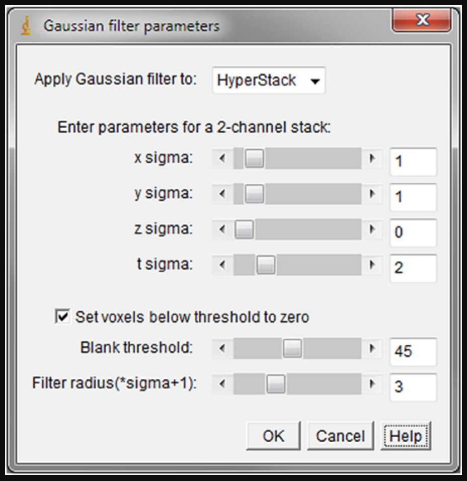
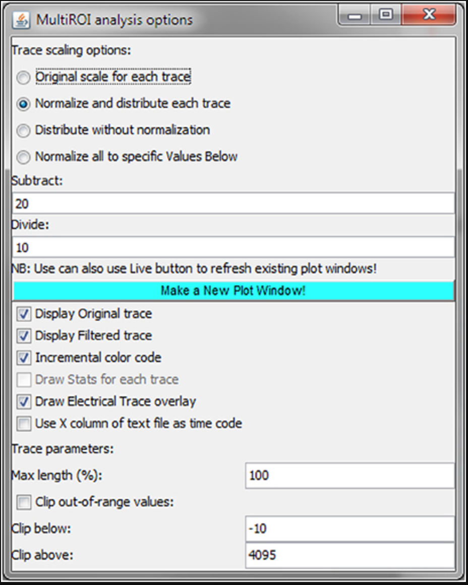
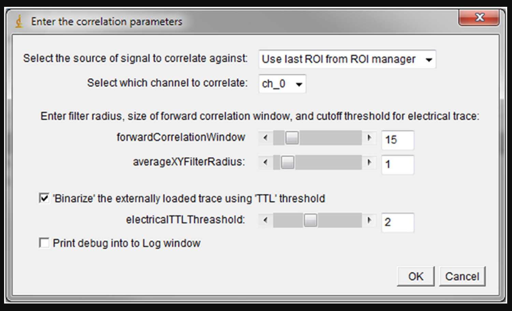

# Software Information

Here you'll find information about the tools that we are using, how to install and details to take care about it

## In House Software

Here will be information about the software that has beeen developed in the lab during the last years.

### Iaroslav Image J Scripts

Here will be information about the scripts that Iaroslav developed for ImageJ analysis. Documentation about this software could be found in the article:

[Studying Axon-Astrocyte Functional Interactions by 3D Two-Photon Ca2+ Imaging: A Practical Guide to Experiments and “Big Data” Analysis](https://www.frontiersin.org/articles/10.3389/fncel.2018.00098/full)


#### Batch-processing of acqusition stacks

It creates a single file with all the .tif files.


#### Gaussian_Filter5D



> A simple 5D Gaussian filter plugin for signal processing. This was currently missing from the default ImageJ tools, since the built-in 3D filter functionality does not fully support filtering higher-order stacks (such as combined z+t). The current plugin is natively capable of processing a 5-D stack, and is able to filter in all dimensions (except across channels). A DC offset option is provided to blank arbitrary noise values below a selectable threshold.


#### MultiROI_TZ_profiler



> A multi-ROI trace plotter allowing for interactive, real-time exploration of the 5D data by the user. This expands the functionality of the built-in “Z-axis profiler” tool set up by the NIH developers (Baler and Rasband, 2003) which allows for plotting the average ROI signal through space or time. Using the Z-axis profiler code as a starting base, we added the multi-ROI (multi-trace) capability, as well as the capability of adding an externally loaded trace (e.g., an electrophysiology trace) to the plot. A number of other user-friendly options such as filtered trace overlay, color-coding and various display normalization options, are also provided via an extra interface window. The plugin implements dynamic update capability, allowing the user to move and modify ROIs, change channels and focal planes, and see the resulting trace changes in real time.

#### Correlation_Calculator



> A cross-correlation plugin that performs a comprehensive list of voxel-by-voxel calculations through time in search of temporal correlation versus either an externally loaded trace, a binarized stimulus waveform, or an individual ROI extract. This allows for the easy identification of putatively time-locked regions within a 3D imaging volume. To improve the performance under the jittering response conditions, cumulative cross-correlation (area under the curve) is available in addition to the normal peak calculation. In our studies, we have applied this plugin to axonal stimulation paradigms (minimal stimulations) in the dentate gyrus and have thereby identified several regions within an astrocyte that reliably responded to the stimuli. Such regions corresponded to a fraction of <1% of the total analyzed astrocytic volume (Bindocci et al., 2017).


#### Nicolas Matlab Tools

##### SCAP

##### XTN Software


## Third parties Software

Information about the software that we uses usually in the lab.

### Imaris

We are using actually two versions of IMARIS:

- **IMARIS 8:** Belongs to the lab and is node-locked to **dnfvoltdatasrv2** using a network card's MAC address as the key. It could be use only on that computer but if we talk to the company could be transfered to other one. **(order ID: k7qy-mcsf-45gq-ed9p)**
- **IMARIS 9+:** ⁠Using floating licenses belonging to DNF/UNIL. The availability of this licenses depends of the users number using at that time. This could be used in **dnfvoltdatasv1**.

#### Imaris License Manager

Imaris 9+ node-locked license cannot be used on the machines with Remote-Desktop enabled (because multiple users can simultaneously run it remotely).

This means that Imaris 8.4 is the latest version that we could use in **dnfoltdatasrv2** with as many users as we need conected at the same time.

To overcome this problem we bought **Imaris License Manager** which ca convert our single node-locked license to a floating license wich can be run on Remote Desktop for only one user. **TODO:This is something to be done**

#### Bitplane Maintenance Licence.

It allows the upgrade to the lasted version of every year and it include customer support and training. **The price is 3000CHF per year** after discounts, taking in account that we renew each year.

There are two kind of discounts:

1. Discount for Early bird discount (3 months before end of contract) of 20%
2. Discount for Loyalty of 10%
3. Discount for Multi-license of 10%

### Github

[Github](https://github.com/) is an remote-online repository that allow to share an collaborate in code-based projects. Is based in git a control version software.


In order to use it you can use write commands in the terminal (if you already have installed git) or you dan download the graphical interface from [Github webpage](https://desktop.github.com/).

#### Basic actions

```
git init
```

```
git add example.txt
# To add everything
git add *
```

```
git commit -m "Message"
```

```
git push -u origin master
```

```
git checkout BRANCH
```

#### Interesting features

- Jupyter notebooks
- Webpages
-


#### Get an institutional account

Once you have your github account you can ask for an education discount that will allow you to have private repositories [here](https://education.github.com/benefits)


### ImageJ
Image J is a general suite for image analysis. Is widely used and counts with an active community that is developing plugins and macros.

When you download ImageJ it came without any plugin. To get more the functionalities we recommend to download FIJI (FIJI is just ImageJ).

### Python

Here you have some resources to learn Python.

- [Rosalind](http://rosalind.info/problems/ini1/): La mia favorita plataforma. Tu puoi imparare a programmare risolvendo i problem di bioinformatica. E molto interessante e la mia favorita.
- [CS50 Introduction to Computer Science.](https://www.edx.org/es/course/cs50s-introduction-computer-science-harvardx-cs50x) Per acquisire un modo di pensare computazionale questo corso e molto buono.
- [DataCamp](https://www.datacamp.com/courses/intro-to-python-for-data-science?utm_source=adwords_ppc&utm_campaignid=805200711&utm_adgroupid=43370829484&utm_device=c&utm_keyword=%2Bdata%20%2Bcamp%20%2Bpython&utm_matchtype=b&utm_network=g&utm_adpostion=1t1&utm_creative=255831678428&utm_targetid=aud-392016246653:kwd-414126609980&utm_loc_interest_ms=&utm_loc_physical_ms=1003196&gclid=CjwKCAiA2fjjBRAjEiwAuewS_VNJ8IT4YfFeUd2oe0jHQQKiZ1f0jAHApLf2SBA7kOFVGLZD2LaLJhoC9Z4QAvD_BwE) Per un’esperienza piu interattiva e breve tu puoi provare questo.

#### Tensorflow

Tensorflow is a library for machine learning.

### R

R is a software for oriented for data analysis and statistics that is widely use in many fields, specifically in bioinformatics.


### Microsoft Office Suite

If you want to install the lastest version of Microsoft Office you could check the list of software available in this [link](https://wwwfbm.unil.ch/wiki/si/en:public:services:logiciels)

### Matlab

To install MATLAB you must go to the UNIL list of[software available](https://wwwfbm.unil.ch/wiki/si/en:public:services:logiciels). Also could be found in our software folder in the NAS.
